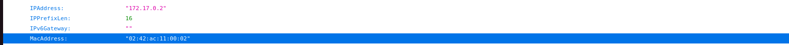
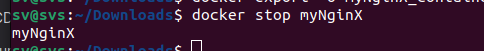

## Part 1. Готовый докер

- Возьми официальный докер-образ с nginx и выкачай его при помощи docker pull.

docker pull nginx

- Проверь наличие докер-образа через docker images

docker images

- Запусти докер-образ через docker run -d [image_id|repository].

docker run -d nginx

- Проверь, что образ запустился через docker ps

docker ps

Посмотри информацию о контейнере через docker inspect [container_id|container_name].

docker inspect 4c89b98c9dd5

-По выводу команды определи и помести в отчёт размер контейнера, список замапленных портов и ip контейнера.
* Размер контейнера можно определить по объединению всех слоев в GraphDriver.Data.LowerDir. В данном случае это не указано явно, но известно, что контейнер использует драйвер overlay2 с множеством слоев, которые указаны в поле LowerDir. В данном случае нет информации о размерах слоёв исходя из команды docker inspect 4c89b98c9dd5.

LowerDir

shmsize возможно нужный размер

* В поле ExposedPorts указаны порты, которые контейнер выставляет наружу:

80/tcp

* В поле IPAddress контейнера указано, что контейнер имеет IP-адрес

172.17.0.2

- Останови докер образ через docker stop [container_id|container_name].

docker stop 4c89b98c9dd5

- Проверь, что образ остановился через docker ps

docker ps

- Запусти докер с портами 80 и 443 в контейнере, замапленными на такие же порты на локальной машине, через команду run.

докер с портами 80 и 443

- Проверь, что в браузере по адресу localhost:80 доступна стартовая страница nginx.

localhost:80

- Перезапусти докер контейнер через docker restart [container_id|container_name].

docker restart myNginX

- Проверь любым способом, что контейнер запустился.

check restart

## Part 2. Операции с контейнером

- Прочитай конфигурационный файл nginx.conf внутри докер контейнера через команду exec.

docker exec -it myNginX cat /etc/nginx/nginx.conf

Создай на локальной машине файл nginx.conf.

local nginx.conf

- Настрой в нем по пути /status отдачу страницы статуса сервера nginx.

/status

- Скопируй созданный файл nginx.conf внутрь докер-образа через команду docker cp.

docker cp

- Перезапусти nginx внутри докер-образа через команду exec

docker exec -it myNginX nginx -s reload

- Проверь, что по адресу localhost:80/status отдается страничка со статусом сервера nginx.

localhost:80/status

- Экспортируй контейнер в файл container.tar через команду export.

docker export -o myNginX_container.tar myNginX

- Останови контейнер.

docker stop myNginX

- Удали образ через docker rmi [image_id|repository], не удаляя перед этим контейнеры.

docker rmi -f nginx

- Удали остановленный контейнер

docker rm myNginX

- Импортируй контейнер обратно через команду import

docker import ~/Downloads/myNginX_container.tar mynginx

- Запусти импортированный контейнер

docker run -d -p 80:80 -p 443:443 --name mynginx_cont  mynginx nginx -g 'daemon off;'

- Проверь, что по адресу localhost:80/status отдается страничка со статусом сервера nginx.

localhost:80/status

